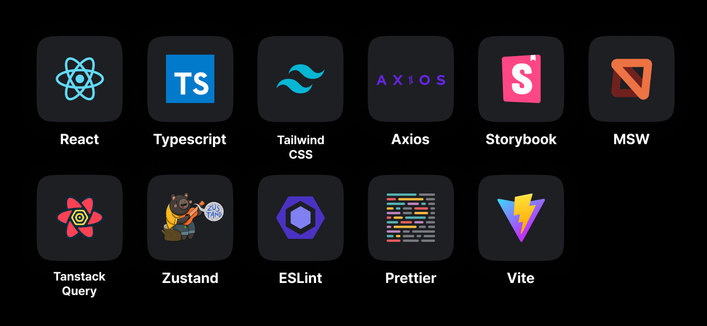
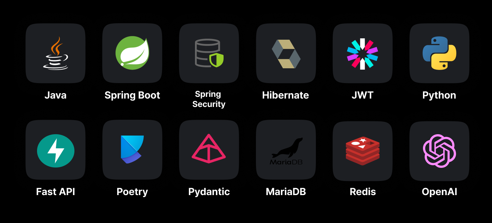
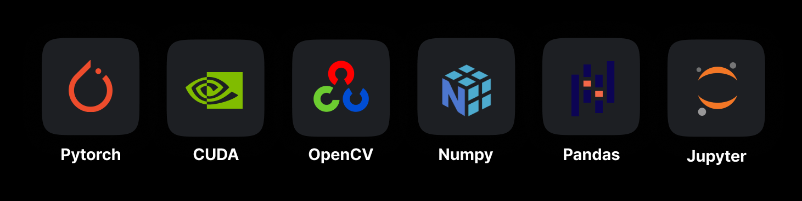
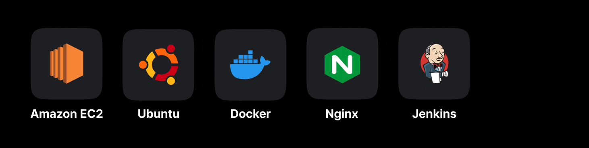
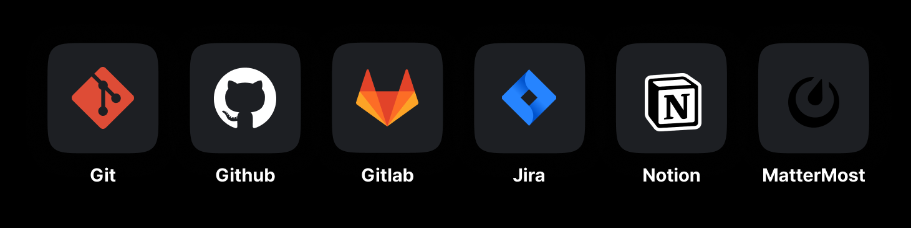
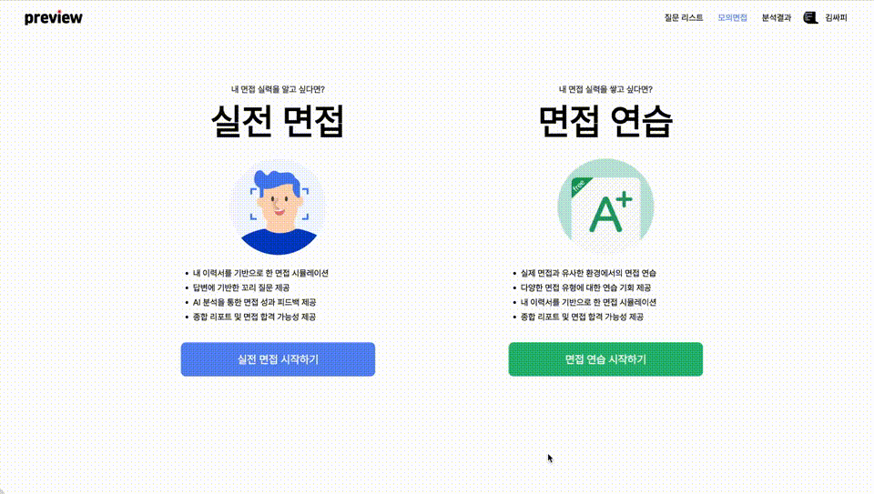

  
   
  <h2>당신의 AI 면접 파트너, preview</h2>

<h4>SSAFY 특화 PJT D102 4반에 내린 단비팀</h4>

    

  
 

## 목차

1. [**웹 서비스 소개**](#1)
1. [**기술 스택**](#2)
1. [**주요 기능**](#3)
1. [**시스템 아키텍쳐**](#4)
1. [**서비스 화면**](#5)
1. [**개발 팀 소개**](#6)
1. [**개발 기간 및 일정**](#7)
1. [**산출물**](#8)

 <!-- 1. [**실행 방법**](#8) -->

 

## ✨ 웹 서비스 소개

면접 준비에 정확한 피드백을 받고 싶었지만구체적인 조언을 얻기 어려웠던 적이 없으신가요?

질문에 대한 답변은 준비했지만, 실제 면접 상황에서의 압박감을 연습할 방법이 없었던 적이 없으신가요?

AI 영상 분석을 통해 당신의 면접을 분석하고 피드백까지 한눈에 ! 
preview를 통해 당신만의 질문을 생성하고 피드백까지 받아보세요.

### [preview 바로 가기](https://j10d102.p.ssafy.io)

 

## 🛠️ 기술 스택

### Frontend

 

### Backend

 

### AI

 

### Infra

 

### Tools

 
 

## 💡 주요 기능

|         기능          | 내용                                                                                                                                                                                    |
| :-------------------: | :-------------------------------------------------------------------------------------------------------------------------------------------------------------------------------------- |
| 이력서 기반 질문 생성 | 내 이력서를 직접 업로드 하고, 업로드 한 이력서를 기반으로 면접 질문을 생성할 수 있습니다.                                                                                               |
|   면접 연습 및 녹화   | 면접 연습에서는 3개의 질문을 선택 후 나의 실력을 확인할 수 있습니다. 면접 실전에서는 질문을 선택하지 않고 공통 및 이력서 기반의 질문으로 실전 면접에 대비할 수 있습니다.                |
|   무작위 꼬리 질문    | 면접 실전 모드 진행 시, AI가 나의 답변을 기반으로 꼬리 질문을 생성합니다.                                                                                                               |
|      분석 보고서      | 면접 영상 분석 후 면접 합격 가능성 및 세부 분석에 대한 분석 결과를 제공받을 수 있습니다. 하나의 질문에 대한 감정 분석, 답변 의도 분석, 키워드 포함 여부 분석 결과를 확인할 수 있습니다. |

 

## 📂 시스템 아키텍쳐

 

## 🖥️ 서비스 화면

### 이력서 업로드 및 이력서 기반 질문 생성

- 이력서 등록 시 이력서 조회, 미리보기, 다운로드 기능 제공
- 등록한 이력서를 기반으로 질문리스트에서 질문 조회 가능

 

### 면접 연습 모드

- 질문 리스트 중 3개의 질문을 선택 후 면접 진행
- 면접 연습 진행 중 키워드, 스크립트 조회 가능

 

### 실전 면접 모드

- 이력서 기반 질문이나 공통 질문 중 랜덤 질문으로 면접 진행
- 이전 답변에 대한 무작위 꼬리질문 제공
- 면접 진행 중 키워드, 스크립트 조회 불가

 

### 분석 결과 조회

- 하나의 면접 질문에 대한 답변 분석 결과 제공
- 감정 부석, 답변 의도, 키워드 포함 여부 조회 가능

 

## 👨🏻‍💻 개발 팀 소개

|                           |      |   |     |      |              |
| :---------------------------------------------------------------------------------: | :---------------------------------------------------------: | :---------------------------------------------------: | :-------------------------------------------------------: | :---------------------------------------------------------: | :-----------------------------------------------------------------: |
| [신주용 @cheesecat47](https://github.com/cheesecat47) `BE` `AI` `Leader` | [박단비 @danbeeS2](https://github.com/danbeeS2) `FE` | [서준호 @ho97s](https://github.com/ho97s) `BE` | [이승현 @hyun812](https://github.com/hyun812) `FE` | [이수화 @rosielsh](https://github.com/rosielsh) `FE` | [최호조 @choihojo](https://github.com/choihojo) `BE` `Infra` |

 

## 🗓️ 개발 기간 및 일정

2024.02.19.-2024.04.04.

<!--  

## 실행 방법 -->

 

## 📝 산출물

### 1. [기능 명세서](https://lshhh.notion.site/0a9f5265482040cf84fb20b6bc206a22?pvs=4)

### 2. [와이어 프레임](https://lshhh.notion.site/56bb5dbcbda640f5ac61e75e8463ce8b?pvs=4)

### 3. [API 명세서](https://lshhh.notion.site/API-API-71fb2554724a4ea2a3967c8e32af9ee4?pvs=4)

### 4. [ERD](https://lshhh.notion.site/ERD-c9c9ec0de3d144e2ab2031e85aea1a0b?pvs=4)

### 5. [포팅매뉴얼]()

- [AI 포팅매뉴얼](https://github.com/d102-preview/preview/blob/main/exec/01.%ED%8F%AC%ED%8C%85%EB%A7%A4%EB%89%B4%EC%96%BC-api-ai.md)
- [Backend 포팅매뉴얼](https://github.com/d102-preview/preview/blob/main/exec/01.%ED%8F%AC%ED%8C%85%EB%A7%A4%EB%89%B4%EC%96%BC-backend.md)
- [Frontend 포팅매뉴얼](https://github.com/d102-preview/preview/blob/main/exec/01.%ED%8F%AC%ED%8C%85%EB%A7%A4%EB%89%B4%EC%96%BC-frontend.md)
