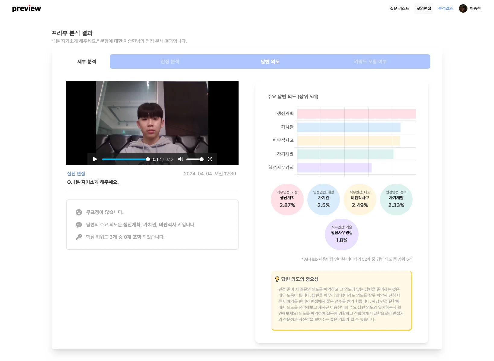

    

> ## **Pre**pare + Inter**view** == **preview**
>
> **preview**는 AI 기반 분석을 통해 비언어적 표현에 대한 피드백을 제공하여 취업 준비생들의 면접 준비에 도움을 주는 서비스입니다.

👉<a href="https://j10d102.p.ssafy.io">서비스 바로가기</a>

---

- [주요 기능 소개](#주요-기능-소개)
  - [이력서 기반 질문 생성](#이력서-기반-질문-생성)
  - [답변 연습을 위한 스크립트, 키워드 작성](#답변-연습을-위한-스크립트-키워드-작성)
  - [면접 연습 / 실전 면접 진행](#면접-연습--실전-면접-진행)
  - [분석 결과 조회](#분석-결과-조회)
- [기술 스택](#기술-스택)
  - [Frontend](#frontend)
  - [Backend](#backend)
  - [Infrastructure](#infrastructure)
  - [AI](#ai)
- [Collaboration](#collaboration)
- [시스템 아키텍처](#시스템-아키텍처)
- [프로젝트 기간](#프로젝트-기간)
- [팀원 소개](#팀원-소개)

---

## 주요 기능 소개

### 이력서 기반 질문 생성

- 마이페이지에서 이력서 등록  
  
- 생성형 AI를 이용해 이력서 기반 질문 생성  
  

### 답변 연습을 위한 스크립트, 키워드 작성

- 스크립트, 키워드 작성  
  

### 면접 연습 / 실전 면접 진행

- 연습 시에는 내가 원하는 문장을 선택하여 연습 가능  
  
- 실전 면접은 업로드 한 이력서를 선택하여 진행  
  

### 분석 결과 조회

|감정 분석|의도 분석|
|:---:|:---:|
|||

## 기술 스택

### Frontend

### Backend

### Infrastructure

### AI

## Collaboration

## 시스템 아키텍처

## 프로젝트 기간

2024.02.19.-2024.04.04.

## 팀원 소개

|  |  |  |  |  |  |
|:----------------------------------------------------------:|:-------------------------------------------------------:|:----------------------------------------------------:|:------------------------------------------------------:|:----------------------------------------------------:|:-------------------------------------------------------:|
|   [신주용 @cheesecat47](https://github.com/cheesecat47) `BE` `AI` `Leader`    |     [박단비 @danbeeS2](https://github.com/danbeeS2) `FE`     |     [서준호 @ho97s](   https://github.com/ho97s) `BE`     |     [이승현 @hyun812](https://github.com/hyun812) `FE`      |      [이수화 @rosielsh](https://github.com/rosielsh) `FE`       |   [최호조 @ubermensch100326](https://github.com/ubermensch100326) `BE` `Infra`    |
