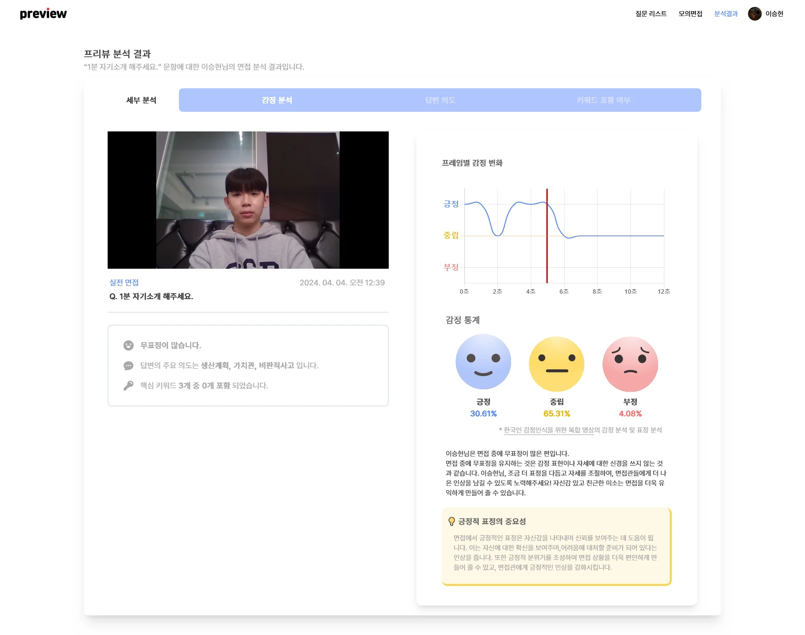

# preview 시연 시나리오

> 시연 순서에 따른 site 화면별, 실행별(클릭 위치 등) 상세 설명

---

## Table of Contents

- [preview 시연 시나리오](#preview-시연-시나리오)
  - [Table of Contents](#table-of-contents)
  - [시나리오 1: 마이페이지에서 이력서 등록](#시나리오-1-마이페이지에서-이력서-등록)
  - [시나리오 2: 질문 리스트](#시나리오-2-질문-리스트)
  - [시나리오 3: 면접 연습 / 실전 면접](#시나리오-3-면접-연습--실전-면접)
  - [시나리오 4: 분석 결과 조회](#시나리오-4-분석-결과-조회)

---

## 시나리오 1: 마이페이지에서 이력서 등록

| 
순서
 | 화면 |
|:---:|:---:|
|마이페이지 접속. 현재는 이력서가 1개 업로드 된 상태.||
|이력서 파일 업로드 화면.| |
|이력서 업로드 된 상태.||
|업로드한 PDF는 뷰어로 볼 수 있음.||

## 시나리오 2: 질문 리스트

| 
순서
 | 화면 |
|:---:|:---:|
|공통 질문, 이력서 기반 질문 목록 확인.| |
|각 질문에 핵심 키워드, 답변 스크립트 저장 가능.||

## 시나리오 3: 면접 연습 / 실전 면접

| 
순서
 | 화면 |
|:---:|:---:|
|질문에 대해 답변하고 녹화. 면접 연습에서는 미리 작성해둔 핵심 키워드와 스크립트를 볼 수 있는 버튼이 있음. 실전 면접에서는 볼 수 없음.| |

## 시나리오 4: 분석 결과 조회

| 
순서
 | 화면 |
|:---:|:---:|
| 감정 분석 결과 ||
|답변 의도 분석 결과||
